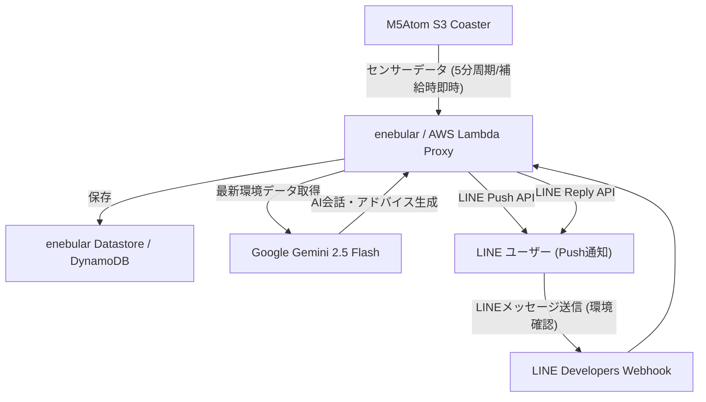

# 水分補給見守りコースター「こまめちゃん」 (Komame-chan Smart Coaster)

コップを置くだけで機能する、M5Atom S3ベースの可愛い水分補給見守りコースター「こまめちゃん」です。
計量ユニットによる水分の重さ計測（ml/g単位）に加え、お部屋の温湿度・気圧をリアルタイムに監視。熱中症リスク（簡易WBGT）や気圧急降下（気象病トリガー）を検知した際や、1時間水分を摂っていないときに、Google Gemini AIが生成したキャラクター「こまめちゃん」の語り口調でLINEに優しく水分補給を促します。また、LINEチャットボットに「部屋の温度は？」などと話しかけるとお部屋の環境を答えてくれます。

---

## 1. システム全体構成



---

## 2. ハードウェア物理構成

### 2.1. 必要パーツ

| 製品名 | 個数 | 説明 | URL | 備考 |
| --- | --- | --- | --- | --- |
| M5 ATOM-S3 | 1 | 計測した値をクラウドにアップロードする本システムのメインマイコン | https://www.switch-science.com/products/8670 | - |
| ATOMIC ToUnit Base | 1 | M5 ATOM-S3に温湿度気圧センサを接続するためのもの。 | https://www.switch-science.com/products/10870 | - |
| M5Stack用温湿度気圧センサユニット Ver.3（ENV Ⅲ） | 1 | 温湿度気圧の測定用 | https://www.switch-science.com/products/7254 | - |
| M5Stack用計量ユニット 5kgレンジ（HX711） | 1 | 水分の重さの計測用 | https://www.switch-science.com/products/9509 | - |

### 2.2. 物理接続とI2Cバス構成

美観を保つため、DIPスライドスイッチを活用して独立した2つのI2Cバスを確立しています。

* **系統1 (計量ユニット用)**:
  - 物理接続: M5Atom S3本体のGroveコネクタ
  - ピン定義: SDA=GPIO 2, SCL=GPIO 1, I2Cアドレス: `0x26`
* **系統2 (ENV Ⅲ ユニット用)**:
  - 物理接続: ATOMIC ToUnit Base経由のポート
  - ピン定義: SDA=GPIO 5, SCL=GPIO 6, I2Cアドレス: SHT30=`0x44` / QMP6988=`0x70`
  - **DIPスイッチ設定**:
    - **IO1 (SDA側)**: GPIO 5 のみ「ON (上)」にし、他はすべて「OFF (下)」
    - **IO2 (SCL側)**: GPIO 6 のみ「ON (上)」にし、他はすべて「OFF (下)」

---

## 3. デバイス（マイコン）側セットアップ手順

### 3.1. ファームウェアの書き込み
本プロジェクトは **PlatformIO (VSCode)** を使用して開発されています。

1. 本リポジトリを VSCode で開きます。
2. `src/main.cpp` の 14行目 `#define ENEBULAR_ENDPOINT "クラウド実行環境のURLを設定"` を、ご自身の **enebular 展開エンドポイントURL** に書き換えます。
3. M5Atom S3 をPCにUSB接続します。
4. PlatformIOの「Build & Upload」を実行し、ファームウェアを書き込みます。

### 3.2. Wi-FiおよびAPIキー設定 (キャプティブポータル機能)
デバイスにWi-Fi設定がない場合、自動的に **設定用アクセスポイント (AP) モード** で起動します。

1. スマートフォンやPCのWi-Fi接続先一覧から `Komame-Setup` を選択して接続します。
2. 自動的にブラウザが立ち上がるか、`http://192.168.4.1/` にアクセスします。
3. 画面の指示に従い、以下を入力します：
   - 接続する **Wi-FiのSSIDとパスワード**
   - デバイスの認証用 **Enebular APIキー**（任意、後述の環境変数と一致させる必要があります）
4. 保存ボタンを押すと、デバイスが自動で再起動し、Wi-Fiへ接続して通常動作を開始します。

### 3.3. キャリブレーション (風袋引き)
* 空のコップをコースターの上に置いた状態で、**M5Atom S3の画面（タクトスイッチ）を押し込む**と風袋引き（ゼロ点補正）が行われ、水分摂取量の積算値がクリアされます。

---

## 4. クラウド (enebular) 側セットアップ手順

### 4.1. バックエンドパッケージの作成
`enebular-backend/` ディレクトリで Node.js プロジェクトが構成されています。

1. ターミナルで `enebular-backend` ディレクトリへ移動します。
2. 依存モジュールのインストール:
   ```bash
   npm install
   ```
3. ZIPファイルの作成 (Adm-Zipを使用):
   ```bash
   node zip.js
   ```
   実行完了後、`enebular-backend/backend.zip` が作成されます。

### 4.2. enebular へのデプロイ
1. enebular コンソールにログインし、プロジェクトから「Cloud Execution Environment (クラウド実行環境)」を選択します。
2. 新しいクラウド実行環境を作成し、ランタイムに **Node.js (AWS Lambda Proxy対応版)** を選択します。
3. `backend.zip` をアップロードしてデプロイします。
4. 発行された **呼び出し用のエンドポイントURL** をマイコン側の `src/main.cpp` にアサインします。

### 4.3. 環境変数の設定
enebular の設定画面で、以下の **環境変数** を定義してください。

| 環境変数名 | 必須 | 説明 |
| --- | :---: | --- |
| `TABLE_ID` | **必須** | enebular Datastore の対象テーブルID |
| `LINE_CHANNEL_ACCESS_TOKEN` | **必須** | LINE Developers から取得したチャネルアクセストークン |
| `LINE_USER_ID` | **必須** | 通知をプッシュ送信するLINEのユーザーID |
| `GEMINI_API_KEY` | **必須** | Google AI Studioから取得した Gemini APIキー |
| `DEVICE_API_KEY` | 任意 | マイコンとバックエンド間の通信認証用APIキー (設定時はマイコンのポータル設定と揃える) |

---

## 5. LINE Developers 設定手順

### 5.1. メッセージ通知とWebhookの紐付け
1. LINE Developers コンソールにログインします。
2. プロバイダー配下に新規の **Messaging API** チャネルを作成します。
3. **Messaging API設定** タブの「Webhook設定」にて：
   - **Webhook URL**: enebularのエンドポイントURLを入力します。
   - **Webhookの利用**: **オン（有効化）** に設定します。
4. LINE Official Account Manager (LINE公式アカウントの管理画面) の **「応答設定」** にて、以下のようにアサインします：
   - **応答メッセージ**: **オフ**（デフォルト返信をさせないため）
   - **チャット**: **オン**（チャット利用を許可）
   - **Webhook**: **オン**（有効化）

### 5.2. LINEチャットボットでのお部屋環境クエリ
LINEチャットで以下のキーワードを送信すると、こまめちゃんが最新の部屋の温度・湿度・気圧を自動応答してくれます。

* **応答トリガーキーワード**:
  `環境, 状態, 部屋, 温度, 湿度, 気圧, wbgt, 熱中症, 調子, 元気, ステータス, 天気, 暑い, 寒い, こまめ`
